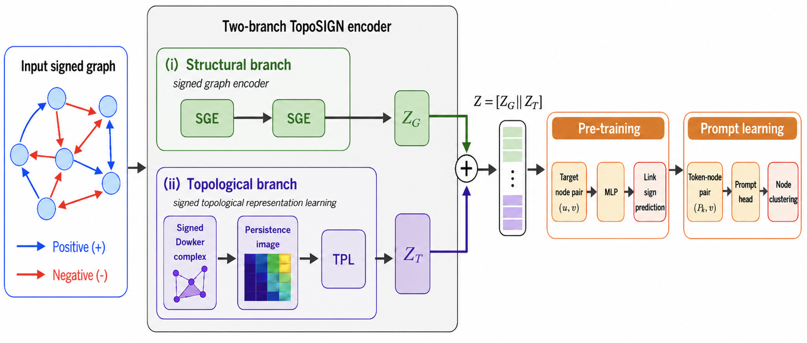

# TopoSIGN

> This is the codebase for the LoG 2026 paper **“Signed Graph Pre-Training and Prompt Learning.”**

<p align="center">
  
</p>

<p align="center">
  <b>Overall framework of TopoSIGN</b>
</p>

TopoSIGN is a topology-guided graph pre-training and prompt learning framework for signed graphs. It learns transferable node representations through two complementary branches: a signed graph encoder (SGE) that captures signed, directional, and local structural information, and a topological representation learning (TPL) branch that summarizes higher-order signed structures using Dowker-complex persistence images. The two representations are fused for pre-training and downstream prompt-based adaptation.

**TopoSIGN** is a graph foundation model for signed directed graphs that combines a signed graph encoder (SGE) with a Topological Projection Layer (TPL) built on Dowker persistence images. Two instantiations are provided:

- **TopoMSGNN** — MSGNN backbone + TPL
- **TopoSSSNET** — SSSNET backbone + TPL

This repository contains the full code to reproduce Tables 1–6 from our NeurIPS 2026 submission.

---

## Environment

Create the conda environment from the provided file:

```bash
conda env create -f environment.yml
conda activate toposign
```

For GPU support, install the PyG sparse extensions separately after activating the environment (adjust the CUDA version as needed):

```bash
pip install torch-scatter torch-sparse \
    -f https://data.pyg.org/whl/torch-2.11.0+cu130.html
```

---

## Repository Structure

```
toposign/
  configs/          Dataset paths, seeds, split ratios, training schedules, hyperparameter grids
  data_generation/  SDSBM graph generation and persistence-image (PI) tensor computation
  data/             Generated SDSBM graphs, cached splits, signed/positive PI tensors
  models/
    backbones/      Self-contained external model code (MSGNN, SSSNET, SigMaNet, DSGC, SAMGPT, prompt modules)
    toposign.py     TopoSIGN two-branch model (SGE + TPL)
    baselines.py    Baseline model wrappers
    gfm.py          GFM prompt-learning adapters (GPPT, Gprompt, GPF, All-in-One, SAMGPT)
  experiments/      Bash entry points for data setup, PI computation, and Tables 1–6
  results/          JSONL results, per-seed curves, and generated LaTeX tables
  run_table1.py     Table 1: GFM pre-training + prompt learning
  run_table2.py     Table 2: Semi-supervised node clustering baselines
  run_table3.py     Table 3: Filtration ablation
  run_table4.py     Table 4: Pre-training task ablation
  run_table5.py     Table 5: Prompt method comparison
  run_table6.py     Table 6: Backbone ablation
  aggregate_results.py  Aggregate JSONL files → console tables + LaTeX
```

---

## Reproduce Everything

Run the full pipeline (data generation → PI computation → all tables → LaTeX):

```bash
bash toposign/experiments/run_all.sh --jobs 5
```

Options:

| Flag | Default | Description |
|---|---|---|
| `--jobs N` | 5 | Parallel jobs per table script |
| `--skip-data-gen` | off | Skip SDSBM generation if data already exists |
| `--skip-pi` | off | Skip PI computation if tensors already exist |
| `--no-hparam-search` | off | Use fixed hyperparameters instead of grid search |
| `--debug` | off | Smoke-test: 2 epochs, reduced seeds |

Set `PYTHON=/path/to/python` to use a specific interpreter.

---

## Individual Steps

**Generate SDSBM datasets:**

```bash
python -m toposign.data_generation.generate_sdsbm
```

**Compute PI tensors (signed + positive, all datasets):**

```bash
bash toposign/experiments/compute_all_pi.sh --jobs 5
```

**Run a single table (e.g. Table 1) with 5 parallel jobs:**

```bash
TABLE_JOBS=5 bash toposign/experiments/table1.sh
```

**Regenerate LaTeX tables from existing JSONL files:**

```bash
python -m toposign.aggregate_results
```

---

## Tables

| Script | Description | Datasets |
|---|---|---|
| `table1.sh` | GFM pre-training + prompt learning (8 methods) | SDSBM-1..4 + Rainfall + SP1500 |
| `table2.sh` | Semi-supervised node clustering (8 methods incl. +Topo) | SDSBM-1..4 + Rainfall + SP1500 |
| `table3.sh` | Filtration ablation (MSGNN + SSSNET backbones) | SDSBM-1..4 + Rainfall |
| `table4.sh` | Pre-training task ablation (SP+DP/3C/4C/5C) | SDSBM-1..4 |
| `table5.sh` | Prompt method comparison (Gprompt/GPF/All-in-one) | SDSBM-1..4 + Rainfall + SP1500 |
| `table6.sh` | Backbone ablation (SigMaNet, DSGC) | SDSBM-1..3 |

Tables 4, 5, and 6 load the TopoMSGNN/TopoSSSNET rows from the Table 1 JSONL — those methods do not need to be re-run.

---

## Training Details

- **Pre-training**: up to 1000 epochs, early stopping patience 400, link-sign prediction task
- **Fine-tuning**: up to 100 epochs, early stopping patience 40, frozen encoder
- **Seeds**: 5 runs per dataset with seeds `0, 10, 20, 30, 40`
- **Input features**: 4D weighted signed-directed in/out degree (`-sd_input_features -weighted_input_features`)
- **Evaluation metric**: Adjusted Rand Index (ARI)

---

## Outputs

```
toposign/results/
  table1_pretrain_finetune.jsonl
  table2_node_clustering.jsonl
  table3_filtration_ablation.jsonl
  table4_pretrain_task_ablation.jsonl
  table5_prompt_comparison.jsonl
  table6_backbone_ablation.jsonl
  curves/                         Per-seed training curves and runtime logs
  latex/                          Generated .tex files for all tables
```

Existing completed JSONL rows and curve files are automatically skipped on re-runs.
